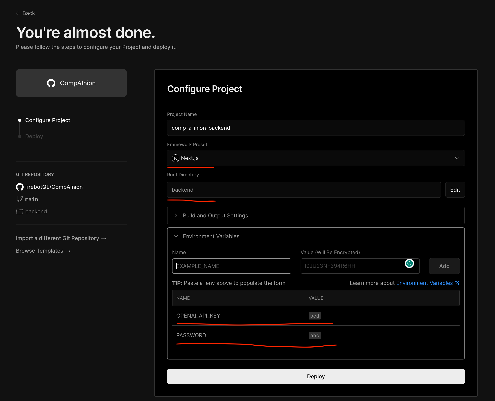

<div align="center">
  
  <h1>CompAInion: Your ChatGPT Assistant</h1>
</div>

Welcome to CompAInion - chrome extension assistant as a sidebar available in all browsing tabs. The main motivation for me why I built it is because I wanted a tool that could integrate ChatGPT into my day-to-day browsing without context switching. Basically, it's a Chrome Extension that adds a chat interface to your browser, which you can use to talk with ChatGPT. The area where you chat opens as a sidebar, so it doesn't interrupt your browsing.

One cool feature is that you can select any text on a webpage, and 'Use' it to be injected directly into your text chat area. It saves you from having to copy and paste so you can continue your chat using that selected text.

To build the extension, I used a mix of tech, including React and TailwindCSS for the front end, and Next.js and Vercel AI SDK for the backend. The backend is deployed to Vercel, and using Edge Functions - which was the only way I found how to get around a 10-second timeout Vercel limitation.

There are some alternatives out there like Monica, Sider.ai, and GPTPlus. But they're not completely free. In contrast, you can use CompAInion Unlimited for free if you have a valid OpenAI ChatGPT API key.

I hope you find CompAInion helpful in your day-to-day browsing. It's still a work in progress, and I'm looking forward to making it even better!

**NOTE: The project is in its early stages and there are several bugs that need attention. You'll find a list of known issues and future enhancements at the end of this README.**

## Table of Contents

- [Table of Contents](#table-of-contents)
- [Demo](#demo)
- [Getting Started](#getting-started)
- [Deploying the Backend Service](#deploying-the-backend-service)
- [Understanding the Project Structure](#understanding-the-project-structure)
- [Installing and Using the Chrome Extension](#installing-and-using-the-chrome-extension)
  - [Preparing Your Project](#preparing-your-project)
  - [Installing the Extension in Chrome](#installing-the-extension-in-chrome)
  - [Using the Extension in Chrome](#using-the-extension-in-chrome)
- [Known Limitations](#known-limitations)
- [Upcoming Tasks/Todos/WIP](#upcoming-taskstodoswip)
- [Contributing to CompAInion](#contributing-to-compainion)

## Demo


https://github.com/firebotQL/CompAInion/assets/78686/9084c30c-604f-4739-aa65-9b9b4dee8ae5


## Getting Started

To make use of this extension, first, ensure you have a ChatGPT API Key. If you don't have one, follow the provided [link](https://help.openai.com/en/articles/4936850-where-do-i-find-my-secret-api-key) to acquire it.

## Deploying the Backend Service

Now that you've got your API key you can deploy your own instance of the backend service by clicking on the "Deploy to Vercel" button shown below. Make sure to set the following environment variables:

- `PASSWORD`: Protects the endpoint, and is sent as an Authorization Header from the Chrome extension.
- `OPENAI_API_KEY`: Your unique ChatGPT API Key.

<p align="center">
  <a href="https://vercel.com/new/clone?repository-url=https%3A%2F%2Fgithub.com%2FfirebotQL%2FCompAInion&env=PASSWORD,OPENAI_API_KEY&envDescription=Refer%20to%20them%20what%20they%20are%20from%20the%20README.md">
    
  </a>
</p>

Or if you prefer to deploy it manually, here are the steps you will need to follow:

1. Fork the repository to your Github account.
2. Log in to your Vercel account.
3. Grant the necessary permissions to access the repository from your GitHub account.
4. Deploy the project by following the settings shown in the image below:



After the deployment, your 'Servel URL' will be in such format:

'https://YOUR_PROJECT_NAME.vercel.app/api/chat/route'

Please replace 'YOUR_PROJECT_NAME' with the name you have entered or that was automatically generated as shown in the previous screenshot. Save above url so we can use it later on to setup chrome extension.

## Understanding the Project Structure

- `backend`: The deployable Next.js service hosted on Vercel, making use of Edge Functions to handle large response timeouts.
- `chrome-extension/core`: Houses the core files for the Chrome extension, including the `manifest.json` configuration.
- `chrome-extension/content`: A React app utilizing Tailwind and ShadeCN for chat functionalities and a context menu for text selection on loaded pages.
- `chrome-extension/popup`: Provides a popup for configuring your server URL and authorization password. These should originate from the deployed 'backend' instance.

## Installing and Using the Chrome Extension

This process involves two key steps:

1. **Preparing Your Project**
2. **Installing the Extension in Chrome**
3. **Using the Extension in Chrome**

### Preparing Your Project

**Prerequisite:** Before running the below commands you will need to have [Node.js](https://nodejs.org/en/) installed on your machine version above 18. And also package manager [yarn](https://classic.yarnpkg.com/en/docs/install) installed.

1. Navigate to your project's root directory and execute the following command to install the necessary dependencies and build the Chrome extension:

   ```
   yarn install && yarn build:chrome
   ```

This action will create a `dist` folder, essentially it's where a fully build Chrome Extension will reside after running the above commands.

### Installing the Extension in Chrome

1. Open Chrome and navigate to `chrome://extensions/`. Enable 'Developer mode' from the top right corner.

2. Click the 'Load unpacked' button and navigate to the `dist` folder in your project directory, which was created in the previous step. Click 'Select' and your Chrome Extension should now be installed and ready for use.

### Using the Extension in Chrome

After you get it installed you will see the CompAInion logo in your extensions bar, click on it and you will see a popup window asking you to enter your server URL and password. Enter the URL of your deployed backend service and the password you set in the environment variables. Click 'Save' and you should be good to go!

You will also see CompAInion icon on the left bottom side to open the chat area/sidebar. Click on it and you will see a chat area/sidebar. You can start chatting with the AI by typing in the chat area.

You can also select any text on any webpage and click on the button that appears to the right of the selected text. This will inject the selected text into your chat area/sidebar. You can then continue your chat using that selected text.

## Known Limitations

- Only supports ChatGPT 3.5 model.
- Does not provide an option to preserve or load chat history.
- Lacks an option for selecting predefined prompt templates.
- Does not have a dark mode available.

## Upcoming Tasks/Todos/WIP

Here are some tasks/todos on my radar (in priority order):

1. Separate the CSS of the extension and the website. Currently, there's an overlap between the webpage's CSS and the extension's CSS. I am considering using a Shadow DOM + Twind solution to solve this, but there are some challenges to overcome.
2. ~~Address this issue across all websites: if any input boxes or similar elements are actively listening for keyboard inputs, we should disable these when the CompAInion sidebar or modal window is open and active.~~
3. Expand the functionality of the text selection/context menu. In addition to including selected text in your chat, introduce more options such as summarizing, explaining in simpler terms, rewriting for better understanding and etc. Any ideas are welcome!
4. Enabling the selection of different ChatGPT models (not restricted to 3.5).
5. Enabling users to save and load chat history.
   - 5.a. An option to switch between global or tab/website-specific history.
6. Providing an option to select predefined prompt templates.
   - 6.a. An option to manually create or upload prompt templates.
7. Adding a dark mode.
8. Introducting authentication to support task 5.

## Contributing to CompAInion

Your contributions are invaluable to me! I welcome bug reports, feature requests, and pull requests to help to improve CompAInion. I appreciate your collaboration!
